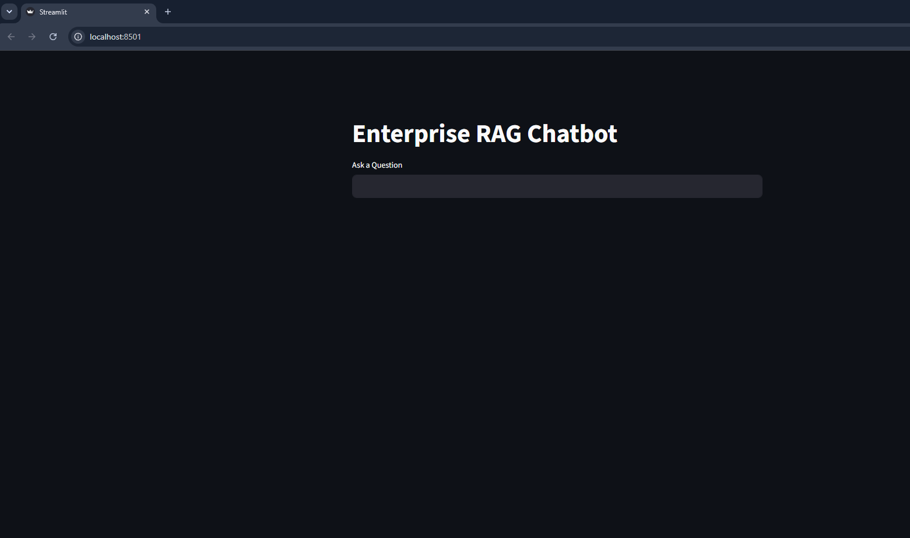
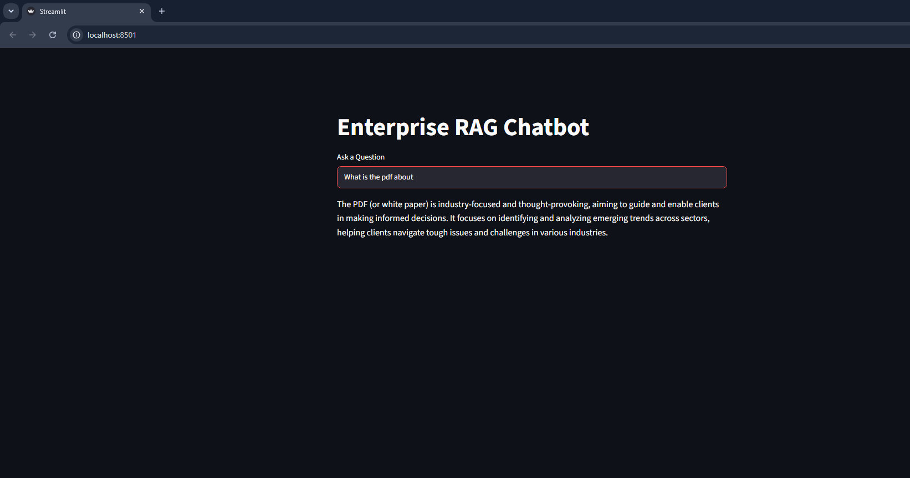

# Enterprise Document Question Answering System using RAG

Developed a RAG-based Document Question Answering System using FastAPI, LangChain, Ollama (Llama 3.2), and FAISS. Implemented PDF parsing, text chunking, vector embeddings, and semantic search to retrieve relevant document context for accurate responses.

## 📸 Application Demo

### Home Page

### Chat Interface

